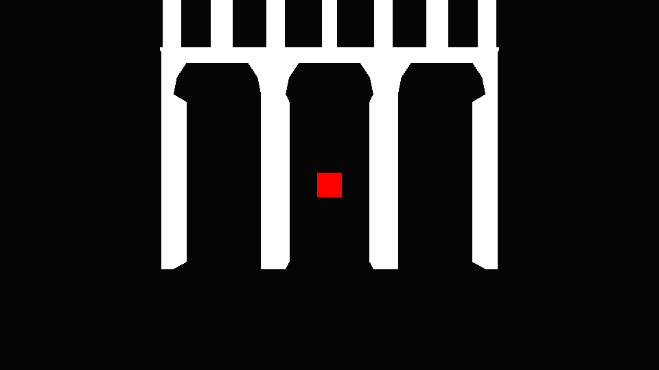
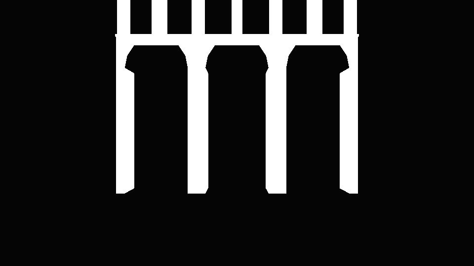
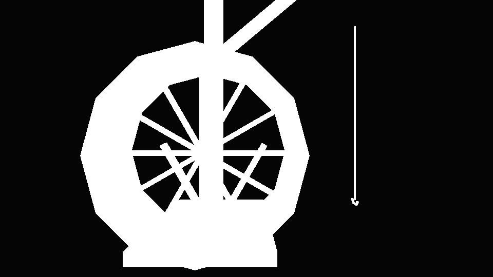
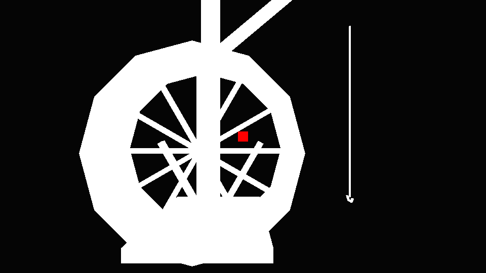
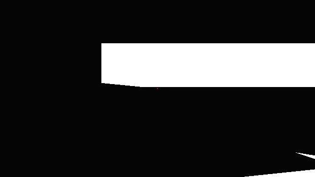
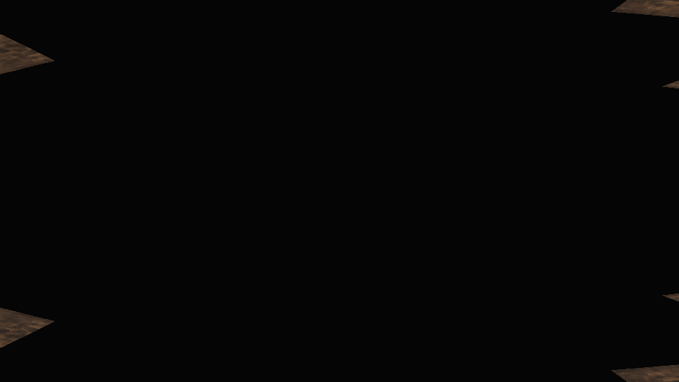

# Mesh culling investigation — 2026-10-01

Two distinct causes were reproduced in Godot 4.5.1's Metal Forward+ renderer. The crane wheel's false occlusion is now corrected in the shipped manifest, loader and export pipeline. Other findings below remain diagnosed defects or explicitly marked candidates.

## Front-facing objects disappear through open structures

`scripts/Level/LevelLoader.gd::_occluders()` turns sufficiently large collision boxes into solid `BoxOccluder3D` instances unless they explicitly opt out. The default does not check whether the visible geometry fills the box. Collision proxies and visual occluders have different requirements: a proxy can deliberately block access to unfinished geometry, but a visual occluder must preserve everything the camera can see through.

The aqueduct is a confirmed example. `tools/level/kit_massing.py:136` supplies one 40 × 40 × 2.6 m collision box for an entire arched segment. All eight exported segments carry that box. The loader makes it visually occlude the open arches too.

The rendered diagnostic uses the actual exported aqueduct mesh, the collider dimensions from the current manifest, and the loader's `_occluders()` function. The segment is placed at the origin and an opaque red box behind its central arch. The camera and materials stay unchanged:

- Occlusion holder hidden: the red object is visible, center pixel `(1, 0, 0)`.
- Occlusion holder enabled: it disappears, center pixel approximately `(0.0196, 0.0196, 0.0196)`.
- In this isolated view, the oversized proxy also hides the aqueduct mesh itself after the occlusion update settles.

| Open arch, occluder hidden | Collision-derived occluder enabled |
| --- | --- |
|  |  |

This shared loader serves the city harbour, city massing and garrison. The reproduction proves the aqueduct defect; other collision proxies require the same visual-versus-collision check.

The correction should introduce dedicated visual occluders, based on actual opaque geometry or conservative solid regions inside it. Keep openings clear and exclude transparent cards, foliage, dynamic objects and dressing that disappears at a distance. Changing triangle winding or disabling material backface culling cannot fix this defect. Godot's [occlusion documentation](https://docs.godotengine.org/en/4.5/tutorials/3d/occlusion_culling.html) describes the separate occluder geometry and its AABB visibility test.

### The crane in the user's recording

The six-second recording supplied after the initial investigation shows the shipyard's `crane_jib` treadwheel. Its rim and spokes surround an open center, but the exported manifest contains a solid collision box centered at `(130.7, 4.7, -3)`, size `(1.1, 4, 4)`. The loader's size threshold admits it as a visual occluder. The box fills the wheel's entire opening.

`tools/diagnostics/crane_occlusion_audit.gd` isolates the actual `crane_jib_001` mesh from `city_harbour/shipyard.glb` and uses that manifest collider through the production loader. With the camera fixed on the wheel, a red object behind the spokes is visible with the occluder hidden and disappears when it is enabled. The crane itself also disappears in this close view after the occlusion update settles. The shader and triangle winding stay identical between captures. This reproduces an additional concrete instance of the proxy defect at the asset shown in the recording; it does not reproduce the exact recorded camera trajectory.

| Crane with occluder hidden | Wheel's solid occluder enabled |
| --- | --- |
|  |  |

The wheel's collider is useful as a movement barrier, but it is unsuitable as a visual occluder. The correction marks only this collider `"occluder": false`. `_occluders()` honors that flag; `_colliders()` still creates the original movement barrier. The crane recipe excludes collider index 2 and the exporter preserves that choice, so exporting the level again cannot restore the faulty occluder. Solid boxes retain the existing default.

After the correction, the rendered diagnostic shows the wheel and the red object behind its spokes with occlusion enabled. Both center samples are `(1, 0, 0)`, and `Reproduced false occlusion` is false. The captures above preserve the original defect; the corrected capture follows:



Reload the city scene to rebuild its occluder nodes. A city already running before the change still contains its previous wheel occluder.

The regression checks cover the shipped manifest, loader's opt-out/default behavior, retained physics collision and rotated recipe placement. The actual Blender exporter was also exercised with a crane placement and its serialized collider data checked. The targeted Godot suites passed 52 assertions; the pure Python level tests passed 155 tests.

### Additional confirmed collision-proxy defects

A scan of four shipped asset directories (`city_harbour`, `city_massing`, `garrison`, `fixture`) examined 74 placed recipe types, representing 2,535 mesh instances. Their 185 eligible recipe boxes were sampled with 9 × 9 rays along each of three axes against the actual exported triangles, with backface collision enabled. Thirty box/axis projections contained a clear ray through a supposedly opaque proxy. This is candidate discovery, not a claim that all thirty produce visible popping.

Six more recipe types reproduced false occlusion in isolated rendered checks. Each uses the actual exported mesh, its local recipe collider, the production `_occluders()` function, and a stationary camera. A small red object behind a clear portion of the mesh appears with the proxy hidden and disappears when the proxy is enabled. Each case runs in a separate Godot process and waits for real rendered frames.

| Recipe | Placed instances | Confirmed mismatch | Example placement (x, y, z) |
| --- | ---: | --- | --- |
| `nave_vault` | 84 | A rectangular roof proxy fills space outside the curved vault. | Shipyard `(20.6, 2.5, -12.6)` |
| `caravel` | 1 | The broad hull box extends outside the tapering hull silhouette. | Ships `(-120, 0, 5.5)` |
| `carrack_hull` | 1 | The end-section proxy extends outside the hull silhouette. | Ships `(40, 0, 4.8)` |
| `mass_castle_tower` | 8 | A square box fills corners outside the twelve-sided tower. | Castle `(-163.04, 99.5, -464.69)` |
| `mass_cathedral` | 1 | The full-height transept box fills space above the sloped roof. | Cathedral `(-25, 45, -225)` |
| `statue_king` | 1 | The enclosing box fills empty space around the statue silhouette. | Terreiro `(-55, 2.5, -34)` |

Instance counts identify placements sharing a recipe, not individually reproduced gameplay failures. The close isolated camera paths establish invalid visual occluders; they do not prove every normal player camera exposes each case. These six defects are still unfixed.

| Vault: proxy hidden | Vault: proxy enabled |
| --- | --- |
|  |  |

Before/after captures for the other five confirmed recipes are also saved in `docs/diagnostics/`, named `<recipe>-open.png` and `<recipe>-proxy.png`.

The sampled battlement side walls, Ribeira arcade floor edge and slipway remain candidates. The rendered probes did not reproduce disappearance for the selected battlement and arcade rays; the slipway's baseline marker was already obscured, making that probe inconclusive. Single-sample gaps on stage and mole pieces also remain unconfirmed. They should not receive automatic changes from the ray scan alone.

Fast multi-case/fixed-frame comparisons gave inconsistent results while the occlusion state updated. Only the separate-process perspective probes with real frame waits above are used for these confirmations. The repeatable diagnostic keeps that isolation.

## Reverse sides disappear after material replacement

`LevelLoader._dress()` replaces imported materials by slot name at `scripts/Level/LevelLoader.gd:109`. `Materials.surface()` creates a new `StandardMaterial3D`, whose default is backface culling. `level_surface()` preserves that default for ordinary slots such as `boards` and `brick`. Imported sidedness is not part of the material selection or cache key.

The actual carrack's imported `boards` surface has `CULL_DISABLED` (2). After `_dress()`, it has `CULL_BACK` (0). Its decks are upward-facing single polygons, authored by `tools/level/kit_ships.py:110`; they have no underside geometry. Looking up at a deck therefore loses the surface after the material replacement.

The second rendered diagnostic extracts the actual carrack's boards surface and views it from below. Its imported material fills the center pixel. After calling the production `_dress()` function, the center shows only the dark background. Occlusion culling is disabled throughout this test, isolating the sidedness issue. The imported material is made white and unlit for visibility; those adjustments preserve its original cull mode.

| Imported two-sided surface | Runtime slot material |
| --- | --- |
|  |  |

The same replacement pattern exists in `scripts/Visual/Lights/LightFixture.gd:220`. Some other systems already handle this deliberately: wardrobe cloth strips and armour shells use two-sided materials; foliage cards contain faces in both directions. Those paths should retain their specific treatment.

The correction should explicitly identify thin surfaces that must render from both sides, preserve that choice through material replacement, and include it in shared-material caching. Structural decks can instead gain proper thickness and underside geometry. Imported two-sided flags alone are too broad a rule: Blender exports many closed kit meshes as two-sided as well. Making every world material two-sided would increase work and hide asset errors.

## Winding and transforms

The imported-asset scan found no negative-determinant mesh transforms. The bulk of triangle winding agrees with vertex normals. There are scattered opposed normals, including deliberately rounded foliage-card normals and small triangles on some assets; this is not evidence of a globally reversed export convention. Godot's imported clockwise indices are expected, while the pure Python/Blender source geometry uses counter-clockwise faces.

These findings explain two reproduced classes of disappearance. They do not establish that every reported case has the same cause. Camera clipping into solid meshes and individual malformed faces still need a specific location or reproduction if they remain after these corrections.

## Repeat the rendered diagnostics

Run from the project root using the Godot executable. Use a writable `--log-file` path on this macOS setup.

```sh
Godot --log-file /tmp/occlusion-audit.log --fixed-fps 60 --path . --script tools/diagnostics/occlusion_audit.gd
Godot --log-file /tmp/backface-audit.log --fixed-fps 60 --path . --script tools/diagnostics/backface_audit.gd
Godot --log-file /tmp/crane-audit.log --fixed-fps 60 --path . --script tools/diagnostics/crane_occlusion_audit.gd
```

Each diagnostic prints its observed center pixels and whether the current defect was reproduced, then exits. Captures are written to `/tmp/culling-open-arch.png`, `/tmp/culling-box-arch.png`, `/tmp/deck-imported.png` and `/tmp/deck-runtime.png`. These are investigation tools, not passing gameplay regression tests: after a correction, the relevant `Reproduced ...` result should become false.

The crane diagnostic writes `/tmp/crane-open.png` and `/tmp/crane-occluded.png`.

Probe an additional recipe in a separate process:

```sh
Godot --log-file /tmp/vault-audit.log --max-fps 60 --disable-vsync --path . --script tools/diagnostics/mesh_proxy_audit.gd -- nave_vault
```

The other confirmed arguments are `caravel`, `carrack_hull`, `mass_castle_tower`, `mass_cathedral` and `statue_king`. Captures go to `/tmp/mesh-proxy-audit/<recipe>/`. `tools/diagnostics/mesh_proxy_cases.json` records the audited local recipe dimensions, sample rays and imported nodes; update those fixtures if the assets or recipes change. This tool intentionally tests those proxy shapes, whereas the crane diagnostic reads its current shipped manifest flag.
