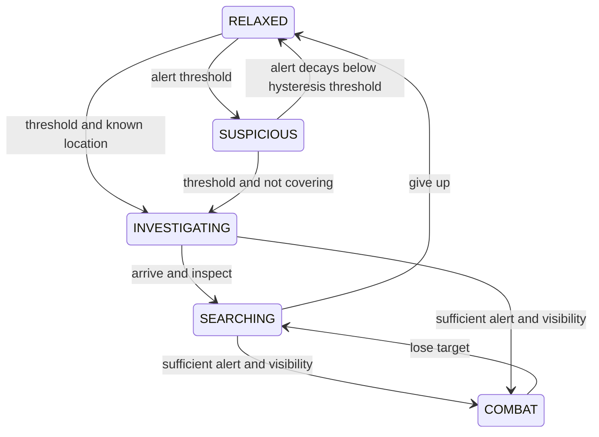

# Guard AI, hunts and daily life

This guide describes the current GDScript implementation. Signatures below preserve declared types: a parameter written with `:=` has a default/inferred type, while plain untyped arguments remain dynamic. Untyped `Array` and `Dictionary` contents are described separately. Durations and `delta` are game seconds, distances are metres, headings are world-space vectors unless identified as local, and angles are radians except exported FOV/slope and attack arc values in degrees.

The guard origin is **at its feet**. Its raised capsule and ground support rays are separate from that origin. Use `eye_position()`, `goal_of()` and rig anchors where their coordinate meaning is required; do not treat player capsule-centre positions as guard feet. The [declaration reference](../reference/README.md) lists every method/property, including private helpers. See [stealth](stealth.md) for exposure, vision, hearing and body detection.

## Responsibilities and ownership

| Script | Owner and responsibility | Main interface |
| --- | --- | --- |
| [Guard.gd](../../scripts/AISystem/Guard.gd) | `CharacterBody3D` orchestrator: senses, alert, movement, health and orders | `hear_sound`, `notice`, `take_hit`, `take_duty`, `send_to_search` |
| [GuardFighter.gd](../../scripts/AISystem/GuardFighter.gd) | One guard's `RefCounted` combat helper; phases, defence, posture and attack reservations | `apply`, `fight`, `watch`, `defend`, `attack_info` |
| [GuardRig.gd](../../scripts/AISystem/GuardRig.gd) | Guard's `Node3D` visual rig, weapon/anchors, animation, wounds and ragdoll handoff | `setup`, `update`, `react_*`, `transfer_to`, `get_up` |
| [GuardBody.gd](../../scripts/AISystem/GuardBody.gd) | `RigidBody3D` remains or collision-free ragdoll proxy | `spawn`, `frob`, `lay_down`, `struck`, `finish_fall` |
| [Temperament.gd](../../scripts/AISystem/Temperament.gd) | Per-guard nerve/drive/guile, dialogue tag and names | `roll`, `tag_of`, `line`, `name_for` |
| [Squad.gd](../../scripts/AISystem/Squad.gd) | Target-scoped hunt shared through a static cache; weak member references | `of`, `join`, `think`, `role_of`, `search_spot_for` |
| [Garrison.gd](../../scripts/AISystem/Garrison.gd) | Target-scoped memory surviving individual hunts | `of`, `tick`, `learn`, `raise_alarm`, `look_into` |
| [Comms.gd](../../scripts/AISystem/Comms.gd) | Static message construction, clock and chorus suppression | `call_out`, `caller`, `may_voice`, `place` |
| [Dangers.gd](../../scripts/AISystem/Dangers.gd) | Static group/physics queries and loose-item reservations | `lit_powder_near`, `behind`, `throwables_near`, `claim` |
| [GuardNav.gd](../../scripts/AISystem/GuardNav.gd) | Per-guard crowd steering, obstacle detours, doors and pursuit estimates | `crowd`, `try_detour`, `walk_detour`, `door_ahead`, `lead`, `scent` |
| [GuardClimb.gd](../../scripts/AISystem/GuardClimb.gd) | Timed traversal owns position while a move is active | `begin`, `retry`, `interrupt`, `update`, `activity` |
| [GuardWater.gd](../../scripts/AISystem/GuardWater.gd) | Water containment, speed limits, swimming buoyancy and path height | `update`, `speed_scale`, `float_him`, `wade`, `activity` |
| [NavBaker.gd](../../scripts/AISystem/NavBaker.gd) | `NavigationRegion3D`: walk/swim/doorway bake and reachability pruning | `bake`, `baked` signal, `is_baked`, counters |
| [NavLinks.gd](../../scripts/AISystem/NavLinks.gd) | Static builder of traversal nodes under a baked region | `build` |
| [SearchSpots.gd](../../scripts/AISystem/SearchSpots.gd) | Static scoring of reachable hiding places and hunt-area constraints | `pick`, `area_of`, `in_area`, `area_centre` |
| [GuardLife.gd](../../scripts/AISystem/GuardLife.gd) | Per-guard conversations, greetings, oddities, missing colleagues and cover | `update`, `at_rest`, `claim_or_cover`, `deal_with_oddity` |
| [GuardHands.gd](../../scripts/AISystem/GuardHands.gd) | Per-guard weapons, pickups, throws, relighting, bells and carried light | `stoop_for`, `lose_weapon`, `throw_held`, `ring_bell`, `interrupt` |
| [GuardMercy.gd](../../scripts/AISystem/GuardMercy.gd) | Per-guard pleading, sparing, escape and allied havens | `update`, `would_beg`, `struck`, `died`, `run_to_haven` |
| [GuardHabits.gd](../../scripts/AISystem/GuardHabits.gd) | Per-guard individual idle work, dozing, visits and equipment | `roll`, `at_rest`, `run`, `interrupt`, `wake`, `head` |
| [GuardPastimes.gd](../../scripts/AISystem/GuardPastimes.gd) | Short idle actions chosen by needs, utility and recent history | `start`, `choose`, `wants_step`, `stop`, `history` |
| [GuardRota.gd](../../scripts/AISystem/GuardRota.gd) | Per-guard station sequence, exclusive occupancy and temporary loans | `setup`, `patrol`, `stir`, `lend`, `end_loan`, `release` |
| [GuardStation.gd](../../scripts/AISystem/GuardStation.gd) | `Marker3D` station configuration and direct `holder: Node` ownership | `facing`, `chest_node`, `drop_node`, `claim`, `release` |
| [GuardVoice.gd](../../scripts/AISystem/GuardVoice.gd) | Per-guard heart, exhaustion, breath and voice priority | `update`, `utter`, `cry`, `emote`, `sounding` |
| [NightRota.gd](../../scripts/AISystem/NightRota.gd) | Optional level-scoped schedule, needs and pending requests | `setup`, `assign`, `swap`, `needs_of`, `take_wanted` |
| [Gathering.gd](../../scripts/AISystem/Gathering.gd) | Level-scoped group activities, relief/rest and station loans | `request`, `tick`, `live`, `member_of`, `end_all` |
| [Talk/TalkScript.gd](../../scripts/AISystem/Talk/TalkScript.gd) | Static `.talk` parser, validator and library cache | `parse`, `load_dir`, `library`, `reload`, `terms` |
| [Talk/TalkFacts.gd](../../scripts/AISystem/Talk/TalkFacts.gd) | Plain participant/world facts, term evaluation and casting | `man`, `sheet_man`, `world`, `holds`, `meets`, `cast_parts` |
| [Talk/TalkDirector.gd](../../scripts/AISystem/Talk/TalkDirector.gd) | Level-scoped conversation scheduler and repetition memory | `tick`, `play`, `play_place`, `call_pair`, `grieve`, `leave` |

`Guard._ready()` builds its helpers, applies archetype settings before setting health, connects `NavigationAgent3D.link_reached`, resolves patrol/stations and gives key holders the corresponding doorway navigation layers. Non-puppets register with `SoundBus` on tree entry and unregister on exit. `puppet` guards join `player` instead of `guards` and bypass autonomous senses/life; combat and rig infrastructure remain available.

`Squad.of(target: Node3D) -> RefCounted` and `Garrison.of(target: Node3D) -> RefCounted` return `null` for invalid targets. `Gathering.of(node: Node)` and `TalkDirector.of(node: Node)` lazily create a director keyed by current scene (or root), returning `null` outside the tree. `NightRota.of(node)` returns `null` until the level explicitly calls `setup(node: Node, p_hour_length: float, start_hour := &"early")`.

Guard calls shared `tick(delta)`/`think(delta)` methods; frame guards make shared time advance once per physics frame even with many callers. `Comms.now()` is physics-frame count divided by the current physics tick rate. Per-guard timers, director clocks and the garrison clock are not interchangeable timestamps. `Garrison.clear_all()` also clears talk, night-rota and gathering caches; `Squad.clear_all()` is separate. Clearing caches is a fresh-start operation, not a graceful interruption of existing activity objects.

## Alert and hunt transitions

`Guard.Alert` values are `RELAXED = 0`, `SUSPICIOUS = 1`, `INVESTIGATING = 2`, `SEARCHING = 3`, `COMBAT = 4`. Alert normally rises toward `combat_at` (100 by default). Defaults are suspicious at 20, investigate at 45, and combat requires visibility at least 0.25. Relaxed/suspicious alert decays after a 2 s hold; suspicious returns to relaxed below 60% of its threshold. Investigation and search finish through behaviour rather than numeric decay.



The diagram shows common paths. Sufficient alert **and** visibility permit combat from any lower state; explicit damage/engagement and orders also affect state. Covering or lookout delegation may keep a guard suspicious while another investigates. Loss of sight does not immediately leave a hunt: fresh calls can sustain pursuit, and the squad continues thinking with hunters/runners as members.

`_set_state(new_state: int) -> void` is the transition boundary. It resets look/wait/search and pending speech, leaves current combat behaviour when appropriate, stirs a relaxed station, ends ordinary conversations, and reports investigation completion to covering friends. Entering combat drops the carried light, stops relighting and evidence pickup, and shouts. Relaxing stands down from the squad, resets lookout departure and resumes patrol. It emits `alert_changed` and cinema events.

| Guard entry point | Inputs, result and effects |
| --- | --- |
| `notice(where: Vector3, why: StringName) -> void` | Stores a world location/reason and raises alert above investigation. Redirects an existing search/investigation; numeric promotion happens in `_update_alert`. |
| `hear_call(where: Vector3) -> void` | Fresh location reported by a hunt; ignored outside assigned hunt area. Clears cover and raises alert. |
| `join_hunt(where: Vector3) -> void` | Runner recruits this guard to last-known location; respects hunt area, leaves lookout post and starts investigation/pathing. |
| `send_to_search(area: AABB, group: StringName = &"") -> void` | Stores `hunt_area`/`hunt_group` metadata before incapacitation/combat checks. Otherwise starts/refreshes search inside the box. Combat continues until its own end. |
| `send_to_bell() -> void` | Sets an alarm errand; if available, runs to a bell then resumes search. Incapacitated/combat guards retain the flag without immediate movement. |
| `call_off_search() -> void` | Removes area/group metadata; does not directly relax or cancel the current hunt. |
| `keep_watch_at(point: Vector3) -> void` | While SEARCHING, sets a world-space watch goal and resets look timing; otherwise no-op. |
| `dazzle(at: Vector3, amount: float) -> void` | Clamps amount to 0..1, applies up to 5 s blindness plus stagger, records flash position and interrupts actions; sub-threshold flashes are ignored. |

### Messages and reservations

`Comms.call_out(speaker: Node3D, what: StringName, where: Vector3, data := {}, db := CALL_DB) -> Dictionary` duplicates the input dictionary and overwrites reserved fields:

| Key | Runtime value |
| --- | --- |
| `what` | `StringName`: `spotted`, `lost`, `danger`, `noise`, `clear`, `look` or `alarm` |
| `where` | `Vector3` reported world location, distinct from the sound origin |
| `time` | `float`, `Comms.now()` |
| `id` | Increasing `int` serial |
| `from` | `WeakRef` to speaker, resolved by `caller(message) -> Node3D` (`null` if absent/gone) |
| extra fields | `heading: Vector3` for lost movement, `radius` for danger reach, `to: WeakRef` for a named investigator |

`SoundBus.emit_message` synchronously dispatches the message event. Guard listeners perform range/navmesh filtering and reject stale sightings. A call is not automatic audible dialogue: callers choose bark/conversation text separately. `may_voice(kind: StringName, where: Vector3, voices := 1) -> bool` both checks and reserves a chorus slot; it is not a pure predicate. Chorus records last 2.5 s within 18 m. `place(where, from)` prefers landmark text, then relative height/direction; compass convention is -Z north, +X east.

`Garrison.look_into(where: Vector3, by: Node3D) -> Node3D` returns **another** active investigator near the point, or `null` after creating/updating this caller's weak reservation. Claims last 15 s within 5 m; `looked(by)` releases them. `GuardLife.claim_or_cover(where) -> bool` returns true when covering another investigator, false when this guard should investigate. `covered_place() -> Vector3` uses `Vector3.INF` when the covering reference/location is absent.

`Dangers.claim(thing: Object, by: Node3D)` stores `claimed_by: WeakRef`; `unclaim` releases only this owner's claim. `claimed(thing, by) -> bool` detects another live, non-incapacitated guard. `claim`/`unclaim` tolerate invalid things; `claimed` expects a valid thing. Station occupancy differs: `GuardStation.holder` is a direct `Node`; `claim(guard) -> bool` accepts free, invalid, incapacitated or same-holder stations, and `release(guard)` clears only a matching holder.

## Combat, morale and remains

`GuardFighter.apply(archetype: StringName)` supports the configured `ARCHETYPES` (swordsman, duelist, brute, archer and trainer). Unknown/empty names leave defaults intact. It updates combat/helper settings without refilling health. `Temperament.roll(archetype: StringName, preset: StringName = &"") -> RefCounted` returns clamped `nerve`, `drive`, `guile` and archetype baseline values, plus a `tag` (steady/stubborn/craven/rash/sly). Presets constrain the named trait; static `rolling = false` suppresses random spread. `line(situation) -> String` may return `""` when no line exists; `name_for(seed: int, female := false)` is deterministic, and Guard handles collisions.

`fight(delta: float)` advances decisions, movement, windup/strike/recovery, defence and attacks. `watch(delta)` advances reactions while movement is otherwise owned (e.g. traversal or stagger). `defend(kind: StringName, attacker: Node3D) -> StringName` returns `parried`, `blocked` or `&""` to allow damage. It can consume parry timing/poise and add posture; power blows may break guard and still land. Defence checks combat state, facing, armed state, phase and recovery openings.

`Guard.take_hit(damage: float, attacker: Node3D, kind: StringName, point: Vector3, direction: Vector3) -> StringName` accepts quick/power/backstab/drop/arrow/thrown/blast/fire/crush attacks. `point` is world-space impact (`ZERO` selects chest); `direction` is blow travel. Freed attackers are treated as `null`. Outcomes are `blocked`, `parried`, `hit`, `killed` or `none` for an already removed guard. It can engage, interrupt, add wounds/bleeding/posture, knock down, sever parts, emit damage signals or spawn remains. Backstab and lethal drop paths can bypass ordinary defence.

`attack_info() -> Dictionary` is always attack metadata, including the idle overhead fallback:

| Key | Type / meaning |
| --- | --- |
| `type`, `call` | `StringName` attack and telegraph category (`cut`, `thrust`, `low`, `unblockable`, `bash`) |
| `guard_damage` | `float`, defence cost scaled for the attack |
| `unblockable`, `heavy`, `low`, `thrust`, `ranged` | `bool` flags consumed by defenders/presentation |

Attack definitions (`ATTACKS`) map `StringName` to numeric dictionaries: windup/damage/guard/recover multipliers, extra reach in metres and arc in degrees. `ARCHETYPES` combine Guard property overrides, fighter odds/limits and appearance data; inspect the source table when adding a key because `apply()` explicitly forwards only selected Guard keys. `Guard.look() -> Dictionary` merges archetype appearance with `look_override`; it does not mutate the scene.

`consume_punish(attacker) -> bool` consumes a matching recovery opening once and adds posture. That opening differs from `is_open()` after posture break; `deathblow_damage(damage)` scales a hit in the latter window and `end_open()` closes it. `release_token()` frees attack/held-shot flags; a held token limits simultaneous attacks per target. Throws additionally use the squad's exclusive, timed throw turn (`may_throw`, `not_throwing`, `threw`).

`Squad.think(delta)` elects leaders and assigns tactics: envelop, press, break, rush, fall_back or rout. Roles include engage/flank/reserve/support/bodyguard/breaker/rally/berserk/hold/fetch/flee/desperate/lookout/intercept. `status_of(guard) -> StringName` reports fighting/hunting/running/down independently of role. `members()` excludes gone/queued/incapacitated members; `fighting()` further restricts combatants against this target. `leave`, `stand_down` and `member_died(guard, killed := true)` remove membership; the last departure dissolves the hunt. Casualties, wounds, arrivals and captain presence affect heart/resolve; resolve is judged for all guards before simultaneous assignment so one new break does not cascade through that same calculation.

Squad `read` tracks turtle/spam/kite/bow/parry/dodge strengths. `Garrison.learn(read: Dictionary, step: float)` grows persistent habits toward stronger observations over 20 s; weaker observations do not erase them. Dread holds 30 s before fading; alarm holds 90 s then settles. `raise_alarm(level: float)` clamps to 0..1, never lowers current alarm and refreshes hold time. Death/body/gore/mercy events update counters, names, dread and alarm; quiet deaths also record missing posts as `{where: Vector3, name: String, at: float, noticed: bool}`. `fear_of(nerve)` and `anger_of(nerve)` translate dread to temperament effects.

`GuardMercy.update(delta: float, target: Node3D, sees: bool, broken: bool) -> bool` takes over fleeing/pleading decisions when applicable. `would_beg()` can change stored refusal/hope state on first judgment. One nearby guard pleads at a time. A player leaving long enough records sparing; an enemy striking ends the plea and discourages another, while a colleague's stray hit is treated differently. `died()` records slain-begging history only during a plea. `find_haven(guard, enemy, shunned := {}, now := 0.0) -> Node3D` seeks usable allies; returns `null` without one. `reset()` clears the fight's mercy state.

`knock_down(push: Vector3, attacker: Node3D = null, at := Vector3.INF)` is a temporary downed/ragdoll condition; `is_downed()` distinguishes it from permanent remains. `knock_out(attacker: Node3D, force := false) -> bool` permanently unregisters/removes the guard, creates unconscious remains, emits `knocked_out` and queues the Guard for deletion. Force bypasses awareness protection; failure reveals the valid attacker's position, raises alert and produces a clang. `die(attacker)` similarly creates corpse remains and emits `died`. Callers must supply a valid attacker for knockout paths that dereference its position.

`GuardBody.spawn(guard: Node3D, killed := false, fall := Vector3.ZERO) -> RigidBody3D` creates remains under the guard's parent. A humanoid with a ragdoll uses a collision-free proxy following the hips; otherwise it creates a layer-3 capsule and visual fall. `GuardRig.transfer_to(corpse: Node3D, push := Vector3.ZERO, at := Vector3.INF)` reparents the humanoid while preserving world transform and transfers ragdoll ownership; caller must invoke the handoff after spawning. Rig wounds/arrows stay with the humanoid and helper lists are cleared. `get_up(face_up: bool) -> float` restores rig-local ownership and returns recovery duration (0 without a humanoid).

Body `can_carry()` returns false for arm-length holding; `frob(player: Node)` requests `player.frob.shoulder(self)` if present. `finish_fall()` finalizes an interrupted fall and suppresses a pool not yet started. `lay_down(rest: Transform3D) -> bool` restarts a dropped humanoid ragdoll at a world transform; false without humanoid/ragdoll. `struck(point, direction, heavy := false, cuts := false)` moves/bleeds remains; cutting dead remains can sever nearby parts. `find_rest_transform(space, center, yaw, exclude)` searches nonoverlapping orientations/offsets; if all fail it returns the requested transform and lets physics resolve it, not `null` or INF.

### Guard signals

| Signal | Payload and emission meaning |
| --- | --- |
| `alert_changed(new_state: int, old_state: int)` | After a changed Alert state is applied |
| `barked(text: String)` | Text/subtitle utterance; emitted even if voice audio priority rejects playback |
| `caught_player(player: Node3D)` | Melee strike passes reach/arc/world checks, before target defence/damage resolves |
| `knocked_out(body: RigidBody3D)`, `died(body: RigidBody3D)` | Created remains before the Guard is freed |
| `found_body(body: Node3D)` | A newly discovered body/part cluster |
| `hurt(amount: float)` | Applied damage notification |
| `struck_by(result: StringName, kind: StringName, damage: float)` | Hit/defence outcome and applied/reportable damage |
| `guard_broken`, `posture_broken` | Defence poise or posture limit reached |
| `feinted`, `answered(how: StringName)` | Attack feint and reaction/answer event |
| `deathblow`, `bound_wounds` | An open-window finishing hit, or completed wound binding |

`NavBaker.baked` has no payload; it marks published navigation completion, not merely the call to `bake()`.

### World hazards and recoverable equipment

`Dangers` queries SceneTree groups (`explosives`, `hazards`, `hanging_weights`, `dropped_weapons`, `alarm_bells`) and physics for world-space locations. The query results below do not automatically reserve an item; callers use claim/unclaim separately. Range arguments are metres, blast/throw mass checks use the object's current properties, and arrays are sorted nearest first where noted.

| Query | Parameters / result |
| --- | --- |
| `lit_powder_near(tree: SceneTree, point: Vector3, margin := POWDER_MARGIN) -> Node3D` | Lit barrel whose explosion could reach point including margin; null otherwise. |
| `powder_near(tree: SceneTree, point: Vector3, radius: float) -> Array[Node3D]` | Unlit nearby barrels, nearest first; empty without matches. |
| `blast_reach(barrel: Object) -> float` | Reads the barrel's configured explosion reach. |
| `behind(asker: Node3D, feet: Vector3, away: Vector3, reach := BEHIND_REACH) -> StringName` | Looks along push away from feet using world physics; returns hazard/drop/empty. Wall obstruction prevents classifying a drop behind it. |
| `throwables_near(guard: Node3D, point: Vector3, radius: float) -> Array[RigidBody3D]` | Eligible resting loose objects, nearest first; excludes held/reserved or unsuitable categories/masses. |
| `throwable(body: RigidBody3D, guard: Node3D = null) -> bool` | Checks resting/mass/category/ownership eligibility; guard distinguishes own claim from someone else's. |
| `weapons_near(tree: SceneTree, point: Vector3, radius: float, kinds: Array = [], guard: Node3D = null) -> Array[RigidBody3D]` | Dropped resting weapons, nearest first; kinds contains weapon-kind StringNames, empty accepts all. Excludes held/other-claimed items. |
| `weight_over(tree: SceneTree, feet: Vector3) -> Node3D` | Hanging weight still above these feet; null without one. |
| `bell_near(tree: SceneTree, point: Vector3, radius: float) -> Node3D` | Nearest currently ringable bell; null without one. |

## Navigation and search contracts

`NavBaker.bake() -> void` starts an asynchronous geometry bake and resets `is_baked`. Its completion path waits for navigation map synchronisation, builds doorway/swim regions, optional links and reachability pruning, then sets `is_baked` and emits `baked`. If the region leaves the tree during waits, it returns without completion. `source_root: NodePath` defaults to the parent; a nonempty path must exist. `bake_bounds: AABB` is region-local; `home: Vector3` is world-space, with INF selecting the biggest island. Agent settings define capsule clearance, height, cell resolution, climb/slope and island size. Doors are excluded from ordinary geometry and get key-dependent regions. Small furniture footprints and sealed polygons are removed; swimming costs four times walking. Async **region iterations** are disabled before building because the renderer/navigation ordering previously stalled map publication; this is distinct from the asynchronous source bake call.

`NavLinks.build(region: NavigationRegion3D) -> int` removes/queues the old `TraversalLinks` holder and creates a replacement. It returns zero with a missing mesh. Link metadata `kind: StringName` identifies climb/drop/leap/ladder/rope/water, and ladder/rope links include `volume: Node3D`. Links carry travel and entry costs; drops/high water entry may be one-way. The builder samples mesh edges and registered `climb_volumes`.

`GuardClimb.begin(details: Dictionary) -> bool` expects NavigationAgent data `owner: NavigationLink3D`, `link_entry_position: Vector3`, `link_exit_position: Vector3`, and recognised owner metadata. Endpoints represent navigation surface; a 0.2 m lift is subtracted for floor coordinates. Missing/remote links, unsupported kinds and ordinary low-bank walking return false. Ladder congestion can also return false **after setting waiting state**. `retry()` resumes when spacing allows; prolonged entry wait marks the path blocked, and prolonged on-ladder hold plans retreat. `interrupt()` releases movement, potentially into a fall. `activity()` supplies rig pose, `progress()` is current-leg 0..1, and `climbed()` is metres for animation pacing. Legs are internal `[to: Vector3, seconds: float, activity: StringName, interpolation_kind]` records; line/fall/arc movements have different trajectories.

`GuardWater.update(delta)` selects `water: Node3D` or null and `swimming: bool`, adjusting agent path height. `speed_scale() -> float` returns 1 out of water or a depth/swim factor. `float_him(delta)` requires swimming water, limits speed, updates vertical buoyancy and emits strokes; `wade(delta)` limits horizontal speed on foot. Activity is `swim`, `tread` or empty. Swimming and active traversal prevent ordinary attacks.

| GuardNav method | Input/output and effects |
| --- | --- |
| `crowd(forward := Vector3.ZERO) -> Vector3` | Returns flat velocity correction in m/s from nearby guards; opposite traffic passes on its own right. Guard list is cached once per physics frame. |
| `new_path() -> void` | Resets temporary-detour count/destination. |
| `try_detour(ahead: Vector3) -> bool` | Tries clear lateral/forward candidates; true stores a timed detour, false means no usable candidate or exhausted attempts. |
| `walk_detour(speed: float, delta: float) -> bool` | Changes velocity/facing; true after reaching/expiring the detour and requesting the same agent goal from the new location. Requires an active detour. |
| `door_ahead(next: Vector3, delta: float) -> Node3D` | Finds a closed door crossing the path; null can mean no door **or throttled check**. Does not open it itself. |
| `lead(target: Node3D, feet: Vector3, dist: float, speed: float) -> Vector3` | Uses dynamic target `velocity: Vector3` to predict an on-mesh destination; returns supplied feet for slow/missing velocity or unsuitable projection. |
| `scent(lost_at: Vector3, heading: Vector3) -> Vector3` | Projects several steps along fresh heading; falls back to lost_at. |

`SearchSpots.pick(guard: Node3D, centre: Vector3, heading: Vector3, reach: float, taken: Array, spread: float, searched: Array, ahead_only := false) -> Dictionary` expects `taken`/`searched` arrays of world `Vector3` points. It rejects unready maps, unavailable/unreachable candidates, taken points within spread, recent searches and positions outside optional `hunt_area: AABB`. It scores light, enclosure, cover, direction, nearby rooms and ledges. Results contain `stand: Vector3`, `peer: Vector3` (INF means no focus), `kind: StringName` (nook/dark/open/room/ledge), plus `door: Node3D` for rooms. `{}` means no suitable place.

`Squad.search_spot_for(guard) -> Dictionary` reserves distributed search ground; `search_point_for(guard) -> Variant` reduces it to `Vector3` or `null`. `watch_point_for(guard) -> Variant` reserves a suitable watcher's vantage or returns `null` for ordinary search. `searched(point: Vector3)` records coverage; fresh sightings update shared last-known position/time/heading. A room entrant can have another member hold the doorway. No caller should move toward `Vector3.INF`: it represents unavailable internal goals/vantages.

## Stations, needs and shared life

`GuardStation.kind: StringName` selects an activity (including `pray` handled by the rota); marker position/facing are world feet/local -Z. `chest: NodePath` and `drop_to: NodePath` resolve rummage/cargo targets as `Node3D` or `null`. Stations register in `guard_stations`. `GuardRota.setup(paths: Array[NodePath])` resolves stations; `set_stations(nodes: Array)` replaces them. Step state is NONE/GOING/ENTER/DOING/EXIT. `stir()` releases ownership/props, closes a chest and starts suitable stand/wake/kneel exit; `release()` clears immediately on incapacitation. `roused(seconds := 60.0)` delays return; `lend(station)` temporarily replaces own stations and `end_loan()` restores the saved list. `busy`, `asleep`, `sheathed`, `on_loan` and `at_station` expose decisions to Guard and presentation.

`Guard.take_duty(duty: Dictionary)` interrupts habits and interprets `{kind: StringName, data: Dictionary}`:

| Kind | `data` schema | Effect |
| --- | --- | --- |
| `post` | `transform: Transform3D` (world home) | Clears route/stations and changes home |
| `round` | `route: NodePath`, resolved relative to Guard | Patrols Node3D children; missing route gives an empty route |
| Other/station duty | `paths: Array` of resolvable station paths | Clears route and hands valid Node3D stations to GuardRota |

`NightRota.add_duty(id: StringName, kind: StringName, data: Dictionary)` stores that contract. `assign(man: Node, id: StringName)` applies known duty now and resets on-post time; invalid man/unknown id are no-op. `swap(a,b)` applies each nonempty counterpart. `duty_of`, `kind_of` and `free_duty` use empty StringName when absent. `hour()` progresses early/middle/late/dawn and clamps at dawn. `needs_of(man)` returns a **live** `{tired: float, hungry: float, cold: float}` dictionary, initialized on demand; `set_need` clamps values. Alarm >= 0.3 or any searching/combat guard suspends new requests, while needs still grow/fall from sleep, eating and fire proximity.

`wanted() -> Array` exposes queued needs; `take_wanted() -> Array` consumes them. Relief is `{kind: &"relief", man: Node, duty: StringName}`; rest is `{kind: &"rest", man: Node, need: StringName}`. `asked(man, what)` remembers deduplication; `forget(man, what)` allows retry. Post-turn duration and full needs request relief/rest; relieved needs must fall below 0.8 before the automatic request repeats. `wants_rest` controls ordinary rest requests, and `Gathering.spontaneous` controls automatic social gatherings.

`Gathering.request(kind: StringName, names := [])` queues `{kind, names: Array of names, at: float}` and brings the next start check forward. Unfulfilled requests expire; `cancel(kind)` removes queued requests, while `end_all()` releases all activities/loans and pending requests. Place nodes join `gathering_places`, carry `gathering` metadata, and have Marker3D spots with `activity` and `role` metadata facing -Z. Standard dice/flask/story activities progress invite -> gathering -> playing; watch_change/round/wake/fire/rest have specialised states. Standard live dictionaries contain kind/members/roles/place/stations/spots/started_at/conversations/state/until/next_at; specialised dictionaries have different keys. `queued`, `live`, `history` and successful `member_of` return stored collections; treat them as read-only. `member_of(man)` returns `{}` if absent.

`GuardLife.update(delta)` ticks talk, optional night rota and gathering and updates idle/oddity/cover timers. `at_ease(man: Node, still := false) -> bool` checks eligibility; `at_rest(delta)` and `walking()` route idleness. Oddities need a look/light except the expected extinguished light; correcting them may close doors, take arrows or relight torches and then investigate. Missing post checks use Garrison history and known relationships. `cover(looker)` keeps a weak investigator reference; an investigator disappearing without `clear` can trigger investigation/alarm.

`GuardHabits` and `GuardPastimes` keep distinct clocks, cooldowns, histories and spot claims. Habits own extended sit/lean/rail/eat/chop/tend/carry/visit/pace/fidget work; `run(delta)` performs that movement and `interrupt()` releases it. `wake(startled := true)` wakes a dozer. Head/step/activity accessors drive presentation or Guard movement. Pastimes select the most pressing need group then a weighted suitable option, avoiding repeats; `start(id: StringName) -> bool` may fail unknown IDs/requirements or inability to begin, `choose() -> StringName` records a selected choice in history and may return empty, and `wants_step() -> Variant` returns a pacing point or `null`. Their histories are activity IDs, not gameplay orders.

`GuardHands.stoop_for(item: Node3D, what: StringName)` claims weapon/throwable/evidence, stops horizontal velocity and runs a timed pickup. Busy/null/freed items are ignored; completion rechecks reach and availability. Evidence is freed; weapons are rearmed and throwables held. `throw_held(aim: Vector3, target: Node3D = null) -> bool` tries progressively higher ballistic arcs, then launches even if the last remains obstructed; false means no valid held item. `lose_weapon(push := Vector3.ZERO, even_put_by := false) -> RigidBody3D` returns dropped equipment or null (unarmed, unavailable rig or sheathed weapon retained); `usable() -> Array` contains compatible weapon-kind StringNames. `relight`, `ring_bell`, `carry_light` and lantern helpers change world equipment/light/alarm. `interrupt()` cancels unfinished pickups, bell pulls and relighting; an already rung bell remains rung.

`GuardVoice.utter(rung: int, text: String, delivery: StringName) -> bool` rejects playback blocked by a higher priority. Ladder values are BREATH=0, CHATTER=1, CALL=2, PAIN=3, DEATH=4. Heart/recovery/exhaustion follow state, running, wounds and garrison fear; breathing supplies expression/audio. `hold_heart(bpm: float)` pins heart to that value until a negative value releases the override, `cry(kind, volume := 0.0)` handles pain/death/roar/grunt, and `delivery_for(marked, uneasy)` resolves whispered/murmured/shouted text style. Missing Sfx recordings leave audio silent while logical text/timing continues.

## Conversation data and APIs

`.talk` files are loaded from `data/talk`. `TalkScript.library() -> Dictionary` lazily caches a library; `reload()` only clears it for the next access. `load_dir(path := FOLDER)` loads sorted files, closes mutual kin/friend/rival ties, validates vocabulary, logs errors and returns partial results alongside errors. `parse(text: String, file: String)` returns `{conversations: Array, cast: Dictionary, errors: Array}` with file:line source labels; parsing does not guarantee validation success. `validate(conv: Dictionary, traits: Array, names := []) -> Array[String]` returns errors, empty when checks pass.

```text
== example
when: at_ease, night:early|middle
cast: A = any; B = friend(A); C? = any
place: dice
cooldown: 10m
priority: 10
group: dice
again: yes
A [shrugs]: A line addressed to {B}.
-- interrupt
A: Hush.
```

A block begins with its ID; recognised header keys are when/cast/place/cooldown/priority/group/again. Commas form conjunctions, `|` alternatives; optional `?` parts may remain empty. Cooldowns accept seconds/minutes or `once` (`-1.0`); default is 300 s. A cast-sheet block `== cast` defines name-keyed rank/traits/ties. Lines select A/B/C/D with optional emotes and `{if condition}`. Adjacent lines of one part whose preceding lines are conditional form one turn, choosing the first matching condition or final fallback.

| Parsed schema | Contents |
| --- | --- |
| Conversation | `{id: String, when: Array, cast: Array, place: StringName, cooldown: float, priority: int, group: StringName, again: bool, lines: Array, interrupt: Array, source: String, sources: Dictionary}` |
| Conditions/requirements | `Array` of alternative `Array`s containing `String` terms |
| Cast requirement | `{key: String, optional: bool, reqs: Array}` |
| Turn | `{part: String, choices: Array}` |
| Choice | `{if: String, emotes: Array, text: String, source: String}` |
| Cast sheet | Name -> `{rank: int, traits: Array, ties: Dictionary}`; each named relationship holds an Array of names |

`TalkFacts.man(guard: Node, sheet: Dictionary) -> Dictionary` gathers live facts. `sheet_man(name: String, sheet: Dictionary, temper := &"steady", kind := &"")` constructs equivalent offline facts with `node: null`. Participant facts contain name/temper/rank/kind/traits/ties/states/station/near/quiet_for/node. `states` has numeric tired/hungry/cold/hurt and boolean grieving/afraid/asleep; near is landmark-name data, quiet_for is seconds. `world(men: Array, tree: SceneTree, extra := {})` accepts nodes or fact dictionaries and combines alert/hunt/alarm/deaths/dread/habits/night/weather/fire/presence and caller situation/place/name facts. It supports a null tree for default offline facts.

`holds(term: String, world: Dictionary, cast := {}) -> bool` evaluates a world term; `meets(man: Dictionary, term: String, cast: Dictionary, world: Dictionary) -> bool` evaluates a participant requirement. Vocabulary includes named relations, mood/temperament, rank/need measurements, night/place/situation and world counters; source constants and `known(term, as_requirement, traits := [], names := [])` define valid words. `cast_parts(conv: Dictionary, men: Array, world: Dictionary, allowed := Callable()) -> Dictionary` returns part -> participant-facts, or `{}` when required casting fails; it uses distinct people and may omit optional roles. `specificity(conv, cast) -> int` ranks matching definitions.

`TalkDirector.play(conv_id: String, cast: Dictionary, extra := {}) -> bool` uses an explicit part -> live-node mapping; false for missing conversation or invalid/occupied members. It bypasses automatic selection. `play_place(members: Array, place: StringName, fixed := {}) -> bool` selects a matching available conversation with pinned parts and current facts; false when no usable cast/candidate exists. Automatic selection weights priority/specificity and repetition limits. One speaker speaks at a time; durations scale with line length/delivery and pauses. Conditions are checked again before a turn, and stirred/gone/distant members can interrupt.

`call_pair(situation: StringName, caller: Node, facts := {}) -> bool` chooses urgent call/answer data; optional `facts.b` pins B and place_name/dead_name provide substitutions. `grieve(man: Node, dead_name: String) -> bool` requires a known friend/kin not already grieved. It sets grief (kin persists; friend fades), can set rash rage, then attempts urgent dialogue; false may still follow those grief side effects if no matching conversation starts. `play_missing(man, missing_name)` selects a missing-colleague exchange. `leave(man, interrupted := true)` ends the whole associated conversation, optionally with its interrupt line.

`in_talk(man)` excludes solo remarks/urgent calls, while `speaking(man)` checks current line time. `speaker_near(man) -> Variant` returns a node or null. `talks() -> Array` returns summary dictionaries `{id, cast, members, turn, started_at, place}` with nested cast/member data; `remarks()` returns `{id, man, at}` summaries; `played()` and `lines_of(man)` expose stored repetition history. Callers should inspect these collections without mutating scheduler state.
