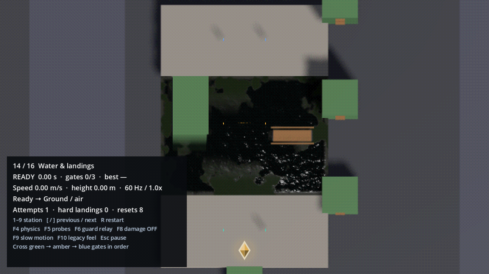

# Wet terrain exits

The failures reproduced on collision geometry, without requiring broken mesh normals:

- Surface swimming did not run the step-up checks. A 34 cm rise into standable shallows, or the harbour's 20 cm quay risers, could stop the capsule indefinitely.
- Swim-to-wade hysteresis could retain swimming on a supported floor that was already shallow enough to walk into from land.
- The obstacle scan required an almost vertical face, rejecting a bank tilted 20 degrees even with a walkable top.
- A fixed 10 cm top inset could miss a thin rail or measure the floor behind it. A water pull-up could also balance on the gunwale instead of entering the boat.

Surface swimming now shares the existing swept step-up and tread hold. Actual support resolves the shallow-water hysteresis band; explicit diving releases that hold. Obstacle scans sample both near the face and at the original inset, keeping the highest top. Steep climb faces are accepted only below the walkable-normal threshold; dedicated kick, hanging, edge and leap face checks retain their previous vertical-face limit. A water clamber across a thin obstacle requires a shallow far floor and a clear capsule route, then settles with zero exit momentum.

All exits still validate capsule clearance. This does not make too-high banks, low ceilings, deep water behind a rail, or obstructed decks climbable. It also does not repair a mesh whose visible surface has no matching collision geometry.

Station **14 — Water & landings** in `maps/traversal_gym.tscn` now has submerged quay steps on the left and the harbour rowboat's collision dimensions on the right. Walk forward into the steps; hold forward and jump to clamber over the boat rail. Use F4 to compare physics rates and F5 to inspect probes.



```sh
GODOT=/path/to/Godot bash tools/run_suites.sh tests/water_geometry_test.tscn tests/swim_polish_test.tscn tests/traversal_test.tscn tests/ledge_polish_test.tscn tests/climb_swim_test.tscn tests/movement_gym_test.tscn
```

The eight wet-geometry regressions exercise standing in shallows, wet stairs, settling inside the boat, tilted banks, safe rejection of unsupported rails and blocked headroom, and diving off a wet tread. The gym suite exercises both new routes with the real player.

Verification on 2026-10-01: all 130 checks across the six suites above passed. The eight wet-geometry cases also passed at both 30 and 120 physics ticks per second (`-- --hz=30` / `-- --hz=120`). The rendered gym capture was inspected on Metal Forward+.

The full 53-suite run produced 1,316 passes and two failures: `garrison_night_test` S7 and `showcase_test` D41, both requiring each cinematic act's first shot to fade up through black. S7 repeated in isolation; D41 passed its isolated rerun (43/43 showcase checks). These showcase scenes do not instantiate the player controller; the S7 cinematic fade issue remains unresolved by this wet-terrain change.
